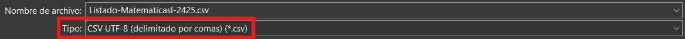
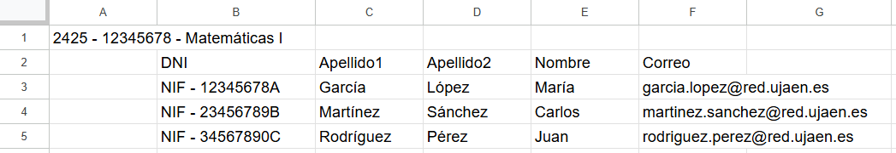

# 🎓 SCANUJA - Sistema de Gamificación Educativa

## 📋 Índice
- [🌟 Introducción](#-introducción)
- [🎯 ¿Qué es el Sistema de Gamificación?](#-qué-es-el-sistema-de-gamificación)
- [👥 Roles y Accesos](#-roles-y-accesos)
  - [🎓 Profesor](#-profesor)
  - [📚 Alumno](#-alumno)
- [👨‍🏫 Manual de Uso para Profesores](#-manual-de-uso-para-profesores)
  - [🔐 1. Registro e Inicio de Sesión](#-1-registro-e-inicio-de-sesión)
    - [Primera vez en la aplicación](#primera-vez-en-la-aplicación)
    - [Usuario existente](#usuario-existente)
  - [📚 2. Pantalla de Inicio (Homepage)](#-2-pantalla-de-inicio-homepage)
    - [Elementos de la pantalla](#elementos-de-la-pantalla)
    - [Importar una Asignatura y sus Alumnos](#importar-una-asignatura-y-sus-alumnos)
    - [Ordenar Asignaturas](#ordenar-asignaturas)
    - [Ocultar/Mostrar Asignaturas](#ocultarmostrar-asignaturas)
    - [Eliminar Asignatura](#eliminar-asignatura)
  - [📖 3. Pantalla de Asignatura](#-3-pantalla-de-asignatura)
    - [Ordenar Alumnos](#ordenar-alumnos)
    - [a) Añadir Alumno Manualmente](#a-añadir-alumno-manualmente)
    - [b) Añadir profesor](#b-añadir-profesor)
    - [c) Importar Notas](#c-importar-notas)
    - [d) Exportar Notas](#d-exportar-notas)
  - [👤 4. Perfil de Alumno](#-4-perfil-de-alumno)
    - [Información mostrada](#información-mostrada)
    - [Acciones disponibles](#acciones-disponibles)
  - [📱 5. Generar Códigos QR](#-5-generar-códigos-qr)
    - [Paso a paso](#paso-a-paso)
    - [Ejemplo práctico](#ejemplo-práctico)
  - [🔍 6. Pantalla de Perfil (Mi Usuario)](#-6-pantalla-de-perfil-mi-usuario)
    - [Información mostrada](#información-mostrada-1)
    - [Acciones disponibles](#acciones-disponibles-1)
- [👨‍🎓 Manual de Uso para Alumnos](#-manual-de-uso-para-alumnos)
  - [🔐 1. Inicio de Sesión](#-1-inicio-de-sesión)
  - [📚 2. Pantalla de Inicio (Mis Asignaturas)](#-2-pantalla-de-inicio-mis-asignaturas)
    - [Elementos de la pantalla](#elementos-de-la-pantalla-1)
    - [Ordenar Asignaturas](#ordenar-asignaturas-1)
  - [📖 3. Pantalla de Asignatura](#-3-pantalla-de-asignatura-1)
    - [Elementos de la pantalla](#elementos-de-la-pantalla-2)
  - [📱 4. Escanear Códigos QR](#-4-escanear-códigos-qr)
    - [Cómo escanear un código QR](#cómo-escanear-un-código-qr)
    - [Mensajes posibles](#mensajes-posibles)
  - [🔍 5. Pantalla de Perfil (Mi Usuario)](#-5-pantalla-de-perfil-mi-usuario)
    - [Información mostrada](#información-mostrada-2)
    - [Acciones disponibles](#acciones-disponibles-2)
- [📄 Formato de Archivos CSV](#-formato-de-archivos-csv)
  - [📝 Consideraciones Generales](#-consideraciones-generales)
  - [1️⃣ Importar Asignatura con Alumnos](#1️⃣-importar-asignatura-con-alumnos)
    - [Estructura del archivo](#estructura-del-archivo)
    - [Explicación detallada](#explicación-detallada)
    - [Ejemplo completo (Excel - delimitador `;`)](#ejemplo-completo-excel---delimitador-)
    - [Ejemplo completo (Google Sheets - delimitador `,`)](#ejemplo-completo-google-sheets---delimitador-)
    - [Errores comunes](#errores-comunes)
  - [2️⃣ Importar Notas con Asignación Automática de Insignias](#2️⃣-importar-notas-con-asignación-automática-de-insignias)
    - [Estructura del archivo](#estructura-del-archivo-1)
    - [Explicación detallada](#explicación-detallada-1)
    - [Sistema de asignación automática](#sistema-de-asignación-automática)
    - [Ejemplo completo (Excel - delimitador `;`)](#ejemplo-completo-excel---delimitador--1)
    - [Ejemplo completo (Google Sheets - delimitador `,`)](#ejemplo-completo-google-sheets---delimitador--1)
    - [Validaciones y Errores](#validaciones-y-errores)
    - [Seguridad y Validación](#seguridad-y-validación)
  - [3️⃣ Exportar Notas](#3️⃣-exportar-notas)
    - [Estructura del archivo generado](#estructura-del-archivo-generado)
    - [Explicación](#explicación)
    - [Cálculo de la nota](#cálculo-de-la-nota)
    - [Características](#características)
  - [🛠️ Herramientas Recomendadas para Crear CSV](#️-herramientas-recomendadas-para-crear-csv)
    - [Microsoft Excel](#microsoft-excel)
    - [Google Sheets](#google-sheets)
    - [Editores de Texto (Avanzado)](#editores-de-texto-avanzado)
- [🏆 Sistema de Puntuación e Insignias](#-sistema-de-puntuación-e-insignias)
  - [📊 Tipos de Insignias](#-tipos-de-insignias)
  - [🎯 Tipos de Actividades](#-tipos-de-actividades)
    - [Ejercicio de Pizarra](#ejercicio-de-pizarra)
    - [Preguntas en Clase](#preguntas-en-clase)
    - [Test Platea](#test-platea)
    - [Ejercicio Evaluable](#ejercicio-evaluable)
    - [Actividad temporal personalizada](#actividad-temporal-personalizada)
  - [📈 Cálculo del Ranking](#-cálculo-del-ranking)
  - [🎓 Estrategias para Alumnos](#-estrategias-para-alumnos)
    - [Maximizar Puntuación](#maximizar-puntuación)
    - [Competir Sanamente](#competir-sanamente)
- [❓ Preguntas Frecuentes](#-preguntas-frecuentes)
  - [👨‍🏫 Para Profesores](#-para-profesores)
  - [👨‍🎓 Para Alumnos](#-para-alumnos)
  - [🔧 Técnicas](#-técnicas)
- [📞 Soporte y Contacto](#-soporte-y-contacto)
- [📜 Licencia y Uso](#-licencia-y-uso)
- [🎉 ¡Comience a Usar el Sistema!](#-comience-a-usar-el-sistema)

---

## 🌟 Introducción

¡Bienvenido a SCANUJA! Un **Sistema de Gamificación Educativa** basado en una plataforma diseñada para motivar y premiar el esfuerzo de los estudiantes mediante un sistema de insignias y puntuaciones. Esta aplicación permite a los profesores gestionar asignaturas, alumnos y actividades de forma sencilla, mientras que los alumnos pueden visualizar su progreso y compararse con sus compañeros.

---

## 🎯 ¿Qué es el Sistema de Gamificación?

El sistema de gamificación transforma el aprendizaje tradicional en una experiencia más motivadora mediante:

- 🏆 **Insignias de Bronce, Plata y Oro**: Premios por completar actividades
- 📊 **Ranking de Puntuaciones**: Competición sana entre estudiantes
- 📱 **Códigos QR**: Asignación rápida de insignias en clase
- 📈 **Progreso Visual**: Visualización clara del rendimiento académico
- 📂 **Gestión por CSV**: Importación y exportación masiva de datos

---

## 👥 Roles y Accesos

### 🎓 Profesor
- Gestión completa de asignaturas
- Importación masiva de alumnos mediante CSV
- Generación de códigos QR para actividades
- Visualización de rankings
- Exportación de notas
- Importación de notas con asignación de insignias automática

### 📚 Alumno
- Visualización de asignaturas matriculadas
- Escaneo de códigos QR para obtener insignias
- Consulta de insignias obtenidas
- Visualización de posición en el ranking

---

## 👨‍🏫 Manual de Uso para Profesores

### 🔐 1. Registro e Inicio de Sesión

#### **Primera vez en la aplicación**
1. Abra la aplicación
2. Seleccione **"Regístrate"**
3. Complete el formulario con:
   - DNI: Servirá como primera contraseña de acceso temporal.
   - Nombre y apellidos
   - Correo electrónico institucional (@ujaen.es)
4. Pulse **"Registrarse"**

#### **Usuario existente**
1. Introduzca su correo electrónico
2. Introduzca su contraseña
3. Pulse **"Iniciar Sesión"**

---

### 📚 2. Pantalla de Inicio (Homepage)

Esta es la pantalla principal donde gestiona sus asignaturas.

#### **Elementos de la pantalla:**
- **Botón "Importar CSV"**: Permite añadir asignaturas con alumnos
- **Lista de Asignaturas**: Muestra todas sus asignaturas visibles
- **Menú de Filtros** (🔽): Permite ordenar asignaturas por nombre o curso
- **Asignaturas ocultas**: Acceso rápido a asignaturas archivadas

#### **Importar una Asignatura y sus Alumnos:**

1. **Prepare el archivo CSV** siguiendo el [formato especificado](#1-importar-asignatura-con-alumnos)
2. Pulse el botón **"Importar CSV"**
3. Seleccione el archivo CSV de su dispositivo
4. Confirme la importación
5. Espere a que finalice el proceso (puede ser un proceso lento)
6. Verá un mensaje de confirmación con el número de alumnos importados

> ⚠️ **Importante**: El archivo CSV debe seguir el formato exacto. Consulte la sección [Formato de Archivos CSV](#-formato-de-archivos-csv).

#### **Ordenar Asignaturas:**
1. Pulse el icono de filtros (🔽)
2. Seleccione:
   - **Por Nombre**: Orden alfabético
   - **Por Curso**: Orden cronológico
3. Elija orden **Ascendente** o **Descendente**

#### **Ocultar/Mostrar Asignaturas:**
1. Mantenga pulsada una asignatura o haga click en menú de opciones (⋮)
2. Seleccione **"Ocultar asignatura"**
3. La asignatura se moverá a "Asignaturas Ocultas"
4. Para restaurarla, pulse **"Ver asignaturas ocultas"** y seleccione el icono para mostrarla


#### **Eliminar Asignatura:**
1. Mantenga pulsada una asignatura o haga click en menú de opciones (⋮)
2. Seleccione **"Eliminar asignatura"**
3. **Confirme** la acción (esta operación **NO es reversible**)

> ⚠️ **Advertencia**: Al eliminar una asignatura, se eliminarán también todas las insignias asociadas de los alumnos. Si un alumno no estuviese registrado en más asignaturas, también se eliminaría su cuenta.

---

### 📖 3. Pantalla de Asignatura

Al pulsar sobre una asignatura, podrá ver toda su información.


**📊 Sección Superior:**
- **Curso, código y nombre de la asignatura**
- **Top 5 Ranking**: Los 5 mejores alumnos de la asignatura en función de su puntuación actual

**🔍 Barra de Búsqueda:**
- Busque alumnos por nombre, apellidos o usuario
- Búsqueda en tiempo real

**👥 Lista de Alumnos:**
- Vista de todos los alumnos matriculados
- Puntuación total

  #### **Ordenar Alumnos:**
  - **Por Nombre**: Aplicar orden en función del nombre de usuario
  - **Por Puntuación**: Aplicar orden en función de la puntuación obtenida

**⚙️ Menú de Opciones:**

#### **a) Añadir Alumno Manualmente:**
Permite registrar a un alumno de forma manual, ya sea porque no estaba en el CSV o es un nuevo ingreso.
1. Pulse el icono de menú (+)
2. Seleccione **"Añadir alumno"**
3. Complete el formulario:
   - DNI
   - Nombre y apellidos
   - Correo electrónico
4. Pulse **"Registrar"**

#### **b) Añadir profesor:**
Permite añadir a otro profesor a la asignatura para que pueda gestionarla conjuntamente y acceder a los datos de forma compartida. Para ello, se deberá introducir el nombre de usuario del profesor (obtenido a partir del correo electrónico institucional).
> ⚠️ **Importante**: El profesor añadido debe estar previamente registrado en la aplicación.

#### **c) Importar Notas:**
Permite importar las notas de una actividad específica y asignar automáticamente las insignias correspondientes.
1. Pulse el icono de menú (+)
2. Seleccione **"Importar CSV"**
3. Seleccione el archivo CSV ([ver formato](#2-importar-notas-con-asignación-automática-de-insignias))
4. Confirme la importación
5. Las insignias se asignarán automáticamente según las notas:
    - **8.0 - 10.0** → Insignia de Oro (20 puntos)
    - **6.0 - 7.9** → Insignia de Plata (10 puntos)
    - **4.0 - 5.9** → Insignia de Bronce (5 puntos)
    - **0.0 - 3.9** → Sin insignia

#### **d) Exportar Notas:**
Permite exportar las notas de los alumnos a un archivo CSV. La nota se calcula en función de la puntuación obtenida de cada alumno.
1. Pulse el icono de menú (+)
2. Seleccione **"Exportar CSV"**
3. Elija el formato:
   - **Excel** (delimitador `;`)
   - **Google Sheets** (delimitador `,`)
4. El archivo se descargará automáticamente en la carpeta `Android/data/com.example.sistema_gamificacion/files/CSV_Exports` o en la carpeta `Descargas` de su dispositivo

**Contenido del archivo exportado:**
```
Usuario,Puntuación,Nota (0-10)
alumno1,250,8.50
alumno2,180,6.12
alumno3,150,5.10
```

Las notas se calculan mediante escala lineal normalizada:
- Alumno con más puntos = 10
- Alumno con 0 puntos = 0
- Resto proporcional. Consulte la sección [Cálculo de la nota](#-cálculo-del-ranking) para más detalles.

---

### 👤 4. Perfil de Alumno

Al pulsar sobre un alumno, podrá acceder a su perfil detallado.

#### **Información mostrada:**
- **Nombre de usuario**
- **Nombre y apellidos**
- **Correo electrónico institucional**
- **Asignatura actual**
- **Posición en el ranking** (ej: #3 de 45)
- **Puntuación total**
- **Número de insignias obtenidas**
- **Listado de insignias obtenidas** con detalles:
  - Tipo de actividad
  - Nombre de la actividad
  - Nivel (Bronce/Plata/Oro)
  - Puntos otorgados

#### **Acciones disponibles:**
- **Editar datos**: Permite corregir erratas en el nombre y apellidos
- **Eliminar alumno**: Borra al alumno de la asignatura. Si fuese su única asignatura, también se eliminaría su cuenta.
- **Añadir insignia de forma manual**: Registra una nueva insignia en el alumno de forma manual. Es útil para usuarios que no tengan acceso a la aplicación en el momento.
- **Eliminar insignia**: Puede hacer click en cualquiera de las insignias del listado para eliminarla individualmente. La puntuación se actualizará automáticamente.

---

### 📱 5. Generar Códigos QR

La pantalla de códigos QR permite crear insignias de actividades en tiempo real.

#### **Paso a paso:**

1. **Seleccione la Asignatura:**
   - Tenga en cuenta que no se mostrarán las asignaturas ocultas en el menú de selección.


2. **Seleccione o cree temporalmente el Tipo de Actividad:**
- **Opción A**: Seleccione una actividad previamente definida
  - 📘 **Ejercicio de pizarra**
  - 💬 **Preguntas en clase**
  - 💻 **Test Platea**
  - 📝 **Ejercicio evaluable**


- **Opción B**: Pulse **"Crear actividad temporal"**: Permite crear una actividad rápida sin necesidad de definirla previamente. Se borrará al salir de la aplicación.
    - Introduzca el nombre de la actividad
    - Pulse **"Crear"**

3. **Seleccione el Tipo de Insignia:**
   - 🥉 **Bronce** (5 puntos)
   - 🥈 **Plata** (10 puntos)
   - 🥇 **Oro** (20 puntos)


4. **Utilice el Código QR:**
   - El código QR se genera automáticamente
   - Muestre el código QR en pantalla para que los alumnos lo escaneen
   - Los alumnos recibirán la insignia al escanear
   - Puede generar un nuevo código QR con la misma configuración pulsando **"Generar nuevo código"**

#### **Ejemplo práctico:**
```
Asignatura: 2425-12345678 (Matemáticas I - Curso 2024-25)
Actividad: Test Platea
Insignia: Oro (20 puntos)
```
El alumno que escane el código obtendrá la insignia de oro y sumará 20 puntos a su puntuación total. **Cada insignia podrá ser escaneada por un único alumno.**

---

### 🔍 6. Pantalla de Perfil (Mi Usuario)

Acceda pulsando el icono de usuario en la barra de navegación.

#### **Información mostrada:**
- Nombre de usuario
- Correo electrónico

#### **Acciones disponibles:**
- **Cambiar contraseña**: le enviará un correo para restablecer su contraseña. Consulte la carpeta de spam si no lo encuentra.
- **Cerrar sesión**

---

## 👨‍🎓 Manual de Uso para Alumnos

### 🔐 1. Inicio de Sesión
1. Abra la aplicación
2. Inicie sesión con su correo electrónico institucional y la contraseña temporal proporcionada por el profesor (DNI). Podrá cambiarla posteriormente después desde su perfil.
---

### 📚 2. Pantalla de Inicio (Mis Asignaturas)

Visualice todas las asignaturas en las que está matriculado.

#### **Elementos de la pantalla:**
- **Lista de Asignaturas**: Todas sus asignaturas activas
- **Vista resumida**: Nombre, curso y código
- **Acceso rápido**: Pulse sobre una asignatura para ver detalles

#### **Ordenar Asignaturas:**
1. Pulse el menú de filtros (🔽)
2. Seleccione:
   - **Por Nombre**: Orden en función del nombre de la asignatura
   - **Por Curso**: Orden en función del curso académico

---

### 📖 3. Pantalla de Asignatura

Al pulsar sobre una asignatura, podrá ver información detallada.

#### **Elementos de la pantalla:**

**📊 Sección Superior:**
- **Curso, código y nombre de la asignatura**
- **Top 5 Ranking**: Los 5 mejores alumnos de la asignatura en función de su puntuación actual

**👤 Mi puntuación actual:**
- **Posición en el ranking** (ej: #12 de 45)
- **Puntuación total**

**🏆 Mis insignias** 
- Listado de insignias obtenidas, incluyendo su tipo, nombre y puntuación asignada

---

### 📱 4. Escanear Códigos QR
Pantalla que permite escanear el QR del profesor para recibir insignias

#### 🤳 **Cómo escanear un código QR:**

1. **Acceda a la pantalla QR:**
   - Pulse el icono de QR en la barra de navegación

2. **Permita el acceso a la cámara:**
   - La aplicación solicitará permisos la primera vez
   - Acepte el acceso a la cámara

3. **Escanee el código:**
   - Apunte la cámara hacia el código QR mostrado por el profesor
   - El escaneo es automático
   - No necesita pulsar ningún botón

4. **Reciba la confirmación:**
   - Verá un mensaje de éxito
   - La insignia se añadirá automáticamente a su perfil
   - Los puntos se sumarán a su total

#### **Mensajes posibles:**
- ✅ **"Insignia obtenida correctamente"**: Ha recibido la insignia
- ⚠️ **"Ya tienes esta insignia"**: Ya completó esta actividad anteriormente
- ❌ **"Código QR inválido"**: El código no es válido o ha expirado
- ❌ **"No estás matriculado en esta asignatura"**: El código es para una asignatura en la que no estás inscrito

---

### 🔍 5. Pantalla de Perfil (Mi Usuario)

Acceda pulsando el icono de usuario en la barra de navegación.

#### **Información mostrada:**
- Nombre de usuario
- Correo electrónico

#### **Acciones disponibles:**
- **Cambiar contraseña**: le enviará un correo para restablecer su contraseña. Consulte la carpeta de spam si no lo encuentra.
- **Cerrar sesión**

---

## 📄 Formato de Archivos CSV

Los archivos CSV son fundamentales para la gestión masiva de datos. A continuación se detallan los formatos exactos requeridos.

### 📝 Consideraciones Generales

- ✅ **Codificación**: UTF-8
- ✅ **Extensión**: `.csv`
- ✅ **Delimitadores aceptados**:
  - **Punto y coma** (`;`) para archivos de Excel
  - **Coma** (`,`) para archivos de Google Sheets
- ⚠️ **NO incluya** encabezados adicionales
- ⚠️ **NO incluya** líneas en blanco
- ⚠️ **Respete** el orden exacto de las columnas

---

### 1️⃣ Importar Asignatura con Alumnos

Este formato permite crear una asignatura e importar todos sus alumnos de una sola vez.

#### **Estructura del archivo:**

```csv
Curso - Código - Nombre de la Asignatura (Todo incluido en la misma celda)
    DNI;Apellido1;Apellido2;Nombre;Correo
    NIF - 12345678A;García;López;María;garcia.lopez@red.ujaen.es
    NIF - 23456789B;Martínez;Sánchez;Carlos;martinez.sanchez@red.ujaen.es
    NIF - 34567890C;Rodríguez;Pérez;Juan;rodriguez.perez@red.ujaen.es
```

#### **Explicación detallada:**

**Primera Fila (Datos de la Asignatura):**

La siguiente información debe venir incluida en la primera celda:
```
Curso - Código - Nombre de la Asignatura
```
- **Curso**: Año académico (ej: `2425` para 2024-25)
- **Código**: Código único de la asignatura (ej: `12345678`)
- **Nombre**: Nombre descriptivo (ej: `Matemáticas I`)

**Ejemplo completo:**
```
2425 - 12345678 - Matemáticas I
```

**Segunda Fila:**
Puede estar **vacía** o contener los encabezados (se ignorará)

**Tercera Fila en adelante (Datos de Alumnos):**

Debe incluir los datos omitiendo la primera columna, es decir, **comenzando desde el campo 3B**

| Columna       | Descripción                  | Ejemplo                     | Obligatorio |
|---------------|------------------------------|-----------------------------|-------------|
| **DNI**       | DNI/NIE del alumno           | `NIF - 12345678A`           | ✅ Sí        |
| **Apellido1** | Primer apellido              | `García`                    | ✅ Sí        |
| **Apellido2** | Segundo apellido             | `López`                     | ❌ No        |
| **Nombre**    | Nombre                       | `María`                     | ✅ Sí        |
| **Correo**    | Email institucional completo | `garcia.lopez@red.ujaen.es` | ✅ Sí        |

#### **Ejemplo completo (Excel - delimitador `;`):**

```
2425 - 12345678 - Matemáticas I
    DNI;Apellido1;Apellido2;Nombre;Correo
    NIF - 12345678A;García;López;María;garcia.lopez@red.ujaen.es
    NIF - 23456789B;Martínez;Sánchez;Carlos;martinez.sanchez@red.ujaen.es
    NIF - 34567890C;Rodríguez;Pérez;Juan;rodriguez.perez@red.ujaen.es
```

**⚠️ Formato del archivo:** Recuerde que la aplicación utiliza archivos CSV con codificación UTF-8. Guarde los ficheros con dicho formato para evitar problemas de lectura.


#### **Ejemplo completo (Google Sheets - delimitador `,`):**

```
2425 - 12345678 - Matemáticas I
    DNI,Apellido1,Apellido2,Correo
    NIF - 12345678A,García,López,María,garcia.lopez@red.ujaen.es
    NIF - 23456789B,Martínez,Sánchez,Carlos,martinez.sanchez@red.ujaen.es
    NIF - 34567890C,Rodríguez,Pérez,Juan,rodriguez.perez@red.ujaen.es
```

**⚠️ Formato del archivo:** En Google Sheets se exportan los CSV con codificación UTF-8 por defecto, por lo que no es necesario realizar ningún ajuste adicional.
#### **⚠️ Errores comunes:**

| ❌ Error                               | ✅ Solución                                                                                                                                                                                                   |
|---------------------------------------|--------------------------------------------------------------------------------------------------------------------------------------------------------------------------------------------------------------|
| Falta el guion `-` en la primera fila | Use exactamente: `Curso - Código - Nombre`                                                                                                                                                                   |
| Formato de curso incorrecto           | Recuerde que el formato de curso contiene 4 números. No incluya años completos, sino las dos últimas cifras de cada uno. Para el curso 2024 - 2025 se debe indicar 2425                                      |
| Formato de DNI incorrecto             | Recuerde que el formato de DNI de los alumnos sigue la estructura 'NIF - 12345678A'                                                                                                                          |
| DNI duplicado                         | Cada alumno debe tener un DNI único                                                                                                                                                                          |
| Formato de email incorrecto           | Use el formato completo: `nombre@red.ujaen.es`                                                                                                                                                               |
| Columnas en orden incorrecto          | Respete el orden definido: DNI, Apellido1, Apellido2,Nombre,Correo                                                                                                                                           |
| Líneas en blanco entre alumnos        | Elimine todas las líneas vacías                                                                                                                                                                              |
| Formato de fichero incorrecto         | La aplicación solamente detectará archivos con extensión .csv y codificación UTF-8. Compruebe que no hay datos obligatorios vacíos y que está siguiendo correctamente las indicaciones previamente descritas |

---

### 2️⃣ Importar Notas con Asignación Automática de Insignias

Este formato permite importar las notas de una actividad específica y asignar automáticamente las insignias correspondientes.

#### **Estructura del archivo:**

```csv
Tipo Actividad - Nombre Actividad
email@red.ujaen.es;8.5
email2@red.ujaen.es;6.2
```

#### **Explicación detallada:**

**Primera Fila (Información de la Actividad):**
```
Tipo Actividad - Nombre Actividad
```
- **Tipo Actividad**: Podrá ser uno de los siguientes:
  - `Ejercicio de pizarra`
  - `Preguntas en clase`
  - `Test platea`
  - `Ejercicio evaluable`
- **Nombre Actividad**: Nombre descriptivo de la actividad (ej: `Derivadas Parciales`)

El tipo de actividad y nombre deben ser únicos para cada fichero importado dentro de la misma asignatura. Si se importan dos ficheros con el mismo tipo y nombre de actividad se considerarán repetidos y no se procesará toda la información.

**Segunda Fila en adelante (Notas de Alumnos):**

| Columna   | Descripción                | Ejemplo                     | Obligatorio |
|-----------|----------------------------|-----------------------------|-------------|
| **Email** | Correo completo del alumno | `garcia.lopez@red.ujaen.es` | ✅ Sí        |
| **Nota**  | Nota numérica de 0 a 10    | `8.5`                       | ✅ Sí        |

#### **Sistema de asignación automática:**

| Nota           | Insignia     | Puntos    |
|----------------|--------------|-----------|
| **8.0 - 10.0** | 🥇 Oro       | 20 puntos |
| **6.0 - 7.9**  | 🥈 Plata     | 10 puntos |
| **4.0 - 5.9**  | 🥉 Bronce    | 5 puntos  |
| **0.0 - 3.9**  | Sin insignia | 0 puntos  |

#### **Ejemplo completo (Excel - delimitador `;`):**

```csv
Test platea - Derivadas Parciales
garcia.lopez@red.ujaen.es;8.5
martinez.sanchez@red.ujaen.es;6.2
rodriguez.perez@red.ujaen.es;4.8
```

#### **Ejemplo completo (Google Sheets - delimitador `,`):**

```csv
Ejercicio evaluable - Límites y Continuidad
garcia.lopez@universidad.es,7.8
martinez.sanchez@universidad.es,9.3
rodriguez.perez@universidad.es,5.5
fernandez.gonzalez@universidad.es,8.0
```

**Resultado de este ejemplo:**
- garcia.lopez: Insignia de Oro (20 puntos) - Nota 8.5
- martinez.sanchez: Insignia de Plata (10 puntos) - Nota 6.2
- rodriguez.perez: Insignia de Bronce (5 puntos) - Nota 4.8


#### **⚠️ Validaciones y Errores:**

| ❌ Error                                | Descripción                                      | ✅ Solución                                                      |
|----------------------------------------|--------------------------------------------------|-----------------------------------------------------------------|
| **Nota fuera de rango**                | La nota debe estar entre 0 y 10                  | Corrija las notas al rango válido                               |
| **Alumno no matriculado**              | El alumno no está en la asignatura               | Verifique que el correo sea correcto                            |
| **Insignia duplicada**                 | El alumno ya tiene una insignia de esa actividad | Elimine la insignia anterior o cambie el nombre de la actividad |
| **Formato de primera fila incorrecto** | No se detecta el tipo o nombre de actividad      | Use el formato: `Tipo Actividad - Nombre Actividad`             |
| **Email inválido**                     | El formato del correo no es válido               | Use el formato completo: `nombre@red.ujaen.es`                  |

#### **🔒 Seguridad y Validación:**

El sistema valida **TODAS las filas** antes de aplicar cualquier cambio:

1. ✅ Verifica que todos los alumnos existan en la asignatura
2. ✅ Comprueba que las notas estén en el rango 0-10
3. ✅ Valida que no existan insignias duplicadas
4. ✅ Confirma el formato de la actividad

Si **alguna fila** tiene un error:
- ❌ **NO se aplica NINGÚN cambio**
- 📧 Se muestra un mensaje detallado con el error
- 🔄 Puede corregir el archivo y volver a intentarlo

Si **todas las validaciones** son correctas:
- ✅ Se crean las insignias
- ✅ Se asignan a los alumnos
- ✅ Se suman los puntos

---

### 3️⃣ Exportar Notas

Este formato es el generado automáticamente por la aplicación al exportar notas.

#### **Estructura del archivo generado:**

```csv
Usuario,Puntuación,Nota (0-10)
garcia.lopez,250,9.12
martinez.sanchez,180,7.74
rodriguez.perez,300,10.00
```

#### **Explicación:**

| Columna        | Descripción                           | Ejemplo        |
|----------------|---------------------------------------|----------------|
| **Usuario**    | Nombre de usuario                     | `garcia.lopez` |
| **Puntuación** | Puntos totales acumulados             | `250`          |
| **Nota**       | Nota calculada (0-10) con 2 decimales | `9.12`         |

#### **Cálculo de la nota:**

```
Nota = (√(Puntuación del alumno) / √(Puntuación máxima)) × 10
```

**Ejemplo:**
- Puntuación máxima en la clase: 300 puntos
- Alumno con 300 puntos: `(300/300) × 10 = 10`
- Alumno con 250 puntos: `(250/300) × 10 = 9.12`
- Alumno con 180 puntos: `(180/300) × 10 = 7.74`
- Alumno con 0 puntos: `(0/300) × 10 = 0.00`

#### **Características:**
- 📝 Dos decimales de precisión
- 📋 Formato compatible con Excel y Google Sheets
- 📂 Encontrará el archivo exportado en la carpeta `Android/data/com.example.sistema_gamificacion/files/CSV_Exports` o en la carpeta `Descargas` de su dispositivo

---

### 🛠️ Herramientas Recomendadas para Crear CSV

#### **Microsoft Excel:**
1. Cree una nueva hoja de cálculo
2. Introduzca los datos en las columnas correspondientes
3. Guarde como: **"Guardar como" → Tipo: "CSV UTF-8 (delimitado por comas) (*.csv)"**

#### **Google Sheets:**
1. Cree una nueva hoja de cálculo
2. Introduzca los datos en las columnas correspondientes
3. Descargue como: **"Archivo" → "Descargar" → "Valores separados por comas (.csv)"**
4. El formato será automáticamente UTF-8

#### **Editores de Texto (Avanzado):**
- Visual Studio Code
- Notepad++
- Sublime Text

---

## 🏆 Sistema de Puntuación e Insignias

### 📊 Tipos de Insignias

| Insignia      | Color    | Puntos    | Rango de Notas (Asignación automática) | Descripción           |
|---------------|----------|-----------|----------------------------------------|-----------------------|
| 🥉 **Bronce** | Cobre    | 5 puntos  | 4.0 - 5.9                              | Participación básica  |
| 🥈 **Plata**  | Plateado | 10 puntos | 6.0 - 7.9                              | Buen desempeño        |
| 🥇 **Oro**    | Dorado   | 20 puntos | 8.0 - 10.0                             | Excelente rendimiento |

### 🎯 Tipos de Actividades

#### 📘 Ejercicio de Pizarra
- **Color**: Azul
- **Descripción**: Resolución de problemas en clase
- **Ejemplo**: "Resolución de ecuaciones diferenciales"

#### 💬 Preguntas en Clase
- **Color**: Verde
- **Descripción**: Participación activa respondiendo preguntas
- **Ejemplo**: "Debate sobre teoremas fundamentales"

#### 💻 Test Platea
- **Color**: Naranja
- **Descripción**: Evaluaciones online en la plataforma Platea
- **Ejemplo**: "Test de derivadas parciales"

#### 📝 Ejercicio Evaluable
- **Color**: Morado
- **Descripción**: Tareas o ejercicios con valor de evaluación
- **Ejemplo**: "Entrega de proyecto final"

#### ✒️ Actividad temporal personalizada
- **Color**: Verde oscuro
- **Descripción**: Actividad creada de forma rápida y temporal. Se guardará solo durante la sesión actual, pero se mantendrán las insignias asociadas a los alumnos.
- **Ejemplo**: "Actividad especial del día"

### 📈 Cálculo del Ranking

El ranking se calcula sumando todos los puntos de las insignias obtenidas:

**Ejemplo práctico:**
```
Alumno: Juan García López
━━━━━━━━━━━━━━━━━━━━━━━━━━━━━━━━━━
Insignias obtenidas:
  🥇 Test Platea - Derivadas (20 pts)
  🥇 Ejercicio - Integrales (20 pts)
  🥈 Preguntas - Límites (10 pts)
  🥉 Ejercicio - Continuidad (5 pts)
━━━━━━━━━━━━━━━━━━━━━━━━━━━━━━━━━━
TOTAL: 55 puntos → Posición #3 de 45
```

### 🎓 Estrategias para Alumnos

#### **Maximizar Puntuación:**
1. 🎯 Participar activamente en clase (Preguntas en clase)
2. 📝 Completar todos los ejercicios de pizarra
3. 💻 Realizar los tests de Platea con preparación
4. 📚 Entregar ejercicios evaluables con calidad

#### **Competir Sanamente:**
- Compara tu progreso con el Top 5
- Establece metas personales de puntos
- Celebra cada insignia obtenida
- Colabora con compañeros para mejorar juntos

---

## ❓ Preguntas Frecuentes

### 👨‍🏫 Para Profesores

#### **¿Puedo importar alumnos de varias asignaturas a la vez?**
No, debe importar un CSV por asignatura. Sin embargo, puede preparar múltiples archivos CSV e importarlos consecutivamente.

#### **¿El fichero CSV de importar asignatura tiene límite?**
Sí, debido a que la importación de alumnos conlleva su registro en el sistema. Los ficheros CSV no deben contener más de 100 alumnos para evitar la sobrecarga en el sistema. Si necesita importar más alumnos, divida el archivo en varios ficheros y cárguelos poco a poco, dejando un tiempo de reposo para permitir el registro masivo (Por defecto se permiten registros de aproximadamente 100 alumnos por hora).

#### **¿Qué pasa si importo el mismo alumno dos veces?**
El sistema detectará que el alumno ya está registrado y lo omitirá, mostrando un mensaje informativo. No se duplicarán los datos.

#### **¿Puedo modificar una insignia ya asignada?**
No directamente. Debe eliminar la insignia del alumno y asignar una nueva. Esto se hace desde el perfil del alumno o mediante un nuevo CSV de notas con una actividad diferente.

#### **¿Cómo elimino una insignia específica de un alumno?**
Para eliminar una insignia específica, debe acceder al perfil del alumno (dentro del listado de la asignatura), hacer click en la insignia que desea eliminar y confirmar la acción.

#### **¿Puedo cambiar el nombre de una asignatura después de crearla?**
No, el nombre de la asignatura se establece en la importación inicial. Si necesita cambiarlo, debe crear una nueva asignatura.

#### **¿Cuánto tiempo permanece activo un código QR?**
Los códigos QR permanecen activos mientras esté en la pantalla. Al salir de la pantalla o cambiar de actividad, se genera un nuevo código.

#### **¿Los alumnos pueden escanear un QR múltiples veces?**
No, el sistema detecta si un alumno ya tiene una insignia de esa actividad específica y muestra un mensaje informativo.

---

### 👨‍🎓 Para Alumnos

#### **¿Puedo obtener la misma insignia varias veces?**
No, cada insignia por actividad solo se puede obtener una vez. Sin embargo, puede obtener diferentes insignias del mismo tipo (ej: varias insignias de Oro de diferentes actividades).

#### **¿Cómo sé en qué posición estoy del ranking?**
Su posición se muestra claramente en la pantalla de la asignatura, indicando su puesto actual y el total de puntos acumulados.

#### **¿Puedo ver las insignias de mis compañeros?**
No, solamente la puntuación total de los compañeros en el Top 5. Las insignias son privadas para cada alumno.

#### **¿Pierdo puntos si me equivoco en una actividad?**
No, el sistema no penaliza con puntos negativos. Simplemente no recibirá insignia si la nota es inferior a 4.0 en actividades seleccionadas.

#### **¿Las insignias obtenidas en una asignatura cuentan para otras?**
No, cada asignatura tiene su propio sistema de puntuación e insignias independiente.

#### **¿Puedo solicitar que me eliminen una insignia incorrecta?**
Sí, debe contactar con su profesor para que gestione la corrección de insignias.

---

### 🔧 Técnicas

#### **¿Qué navegadores son compatibles?**
La aplicación es compatible con:
- Google Chrome (recomendado)
- Mozilla Firefox
- Microsoft Edge
- Safari (iOS y macOS)

#### **¿Funciona sin conexión a Internet?**
No, la aplicación requiere conexión a Internet para sincronizar datos con la base de datos en tiempo real.

#### **¿Los datos están seguros?**
Sí, todos los datos están protegidos mediante:
- Autenticación de Firebase
- Reglas de seguridad de Firestore
- Conexión HTTPS cifrada

#### **¿Puedo usar el sistema en el móvil?**
Sí, el sistema está diseñado para funcionar tanto en navegadores de escritorio, móviles y su aplicación disponible Android.

#### **¿Hay límite de alumnos por asignatura?**
Sí, se recomienda importar los alumnos en grupos de 100 para mantener un rendimiento óptimo.

---

## 📞 Soporte y Contacto

Si tiene alguna pregunta, problema técnico o sugerencia:

- 📧 **Email**: Contacte con el profesor responsable
- 📚 **Documentación**: Consulte este manual
- 🐛 **Reporte de errores**: Documente el error con capturas de pantalla y pasos para reproducirlo. Envíe la información mediante correo a su profesor.

---

## 📜 Licencia y Uso

Este sistema es una herramienta educativa diseñada para facilitar la gestión y motivación en entornos académicos.

**Uso permitido:**
- ✅ Uso educativo en instituciones académicas
- ✅ Gestión de asignaturas y alumnos
- ✅ Exportación de datos para análisis académico

**Uso NO permitido:**
- ❌ Uso comercial sin autorización
- ❌ Modificación del sistema sin permiso
- ❌ Compartir credenciales de acceso

---

## 🎉 ¡Comience a Usar el Sistema!

**Para Profesores:**
1. ✅ Regístrese o inicie sesión
2. 📄 Prepare su archivo CSV con los datos de su asignatura
3. 📤 Importe el CSV
4. 📱 Genere códigos QR para sus actividades
5. 📊 Visualice el progreso de sus alumnos

**Para Alumnos:**
1. ✅ Inicie sesión con sus credenciales
2. 📚 Revise sus asignaturas
3. 📱 Escanee códigos QR en clase
4. 🏆 Compita sanamente con sus compañeros
5. 📈 Visualice su progreso

<div style="text-align: center;">

### 🌟 ¡Gamifica tu aprendizaje y convierte cada logro en una recompensa! 🌟

---
**SCANUJA - Sistema de Gamificación Educativa** | Versión 1.0.2

**Elena Sánchez Nájera** - [esnajera@ujaen.es](mailto:esnajera@ujaen.es)
</div>